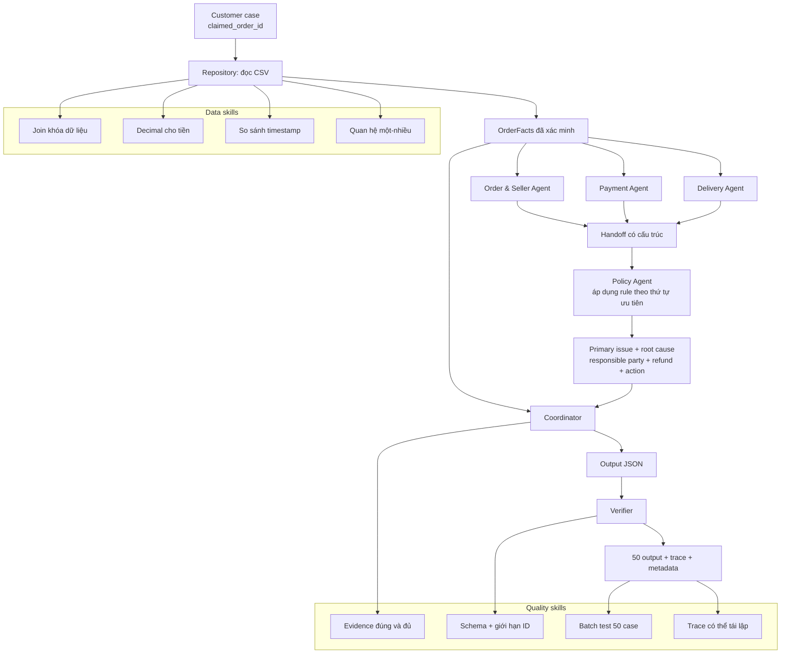

# Ôn tập Lab: Multi-Agent E-commerce Dispute Resolution

## 1. Lab này đang giải quyết việc gì?

Hãy hình dung khách hàng báo: “Đơn của tôi giao trễ, tôi có được hoàn tiền không?”.
Không thể chỉ tin vào câu nói đó. Hệ thống phải đọc dữ liệu gốc để trả lời bốn câu:

1. Đơn có thật sự có vấn đề không?
2. Nếu có, bên nào chịu trách nhiệm: seller, đơn vị logistics hay platform?
3. Bằng chứng CSV nào chứng minh kết luận?
4. Hoàn bao nhiêu tiền và cần làm action gì?

Điểm quan trọng nhất của lab là: **kết luận phải đi từ dữ liệu có thể kiểm tra, rồi mới áp dụng policy**. Không được bịa tracking, refund ledger hoặc sự kiện ngoài CSV.

## 2. Mindmap kiến thức và luồng liên kết



Đọc sơ đồ theo một câu: **case đưa `claimed_order_id` vào Repository; ba agent đọc cùng một bộ facts theo ba góc nhìn; Policy ra quyết định; Coordinator tạo JSON; Verifier chặn sai trước khi nộp.**

## 3. Nền tảng dữ liệu: phải hiểu trước khi viết agent

### 3.1. Khóa join

`order_id` là trung tâm của bài. Từ một order, ta nối được item, payment và review.

| Bảng | Cho biết điều gì? | Khóa liên quan |
| --- | --- | --- |
| `orders` | trạng thái đơn và các mốc thời gian | `order_id`, `customer_id` |
| `order_items` | sản phẩm, seller, giá, phí ship, hạn seller bàn giao | `order_id` |
| `order_payments` | từng dòng thanh toán | `order_id` |
| `customers` | thông tin khách | `customer_id` |

Tư duy cần nhớ: `orders` là **một đơn**, nhưng `order_items` và `order_payments` là **một-nhiều**. Vì thế không lấy một dòng payment rồi cho rằng đó là toàn bộ tiền đơn.

### 3.2. Ba phép tính tiền

```text
item_total_brl    = sum(item.price)
freight_total_brl = sum(item.freight_value)
payment_total_brl = sum(payment.value)
```

Lý do dùng `Decimal` thay vì `float`: tiền cần chính xác. Với số thập phân nhị phân, phép cộng như `0.1 + 0.2` có thể sinh sai số nhỏ; `Decimal` giữ kết quả phù hợp nghiệp vụ.

### 3.3. Timestamp, không chỉ ngày

Khi xét seller có giao carrier muộn hay không, phải so sánh cả ngày **và giờ**:

```text
order_delivered_carrier_date > shipping_limit_date
```

Ví dụ cùng ngày nhưng 16:22 lớn hơn 11:30 thì seller vẫn giao muộn. Đây là bẫy dễ mất điểm nếu chỉ so sánh phần ngày.

## 4. Kiến trúc multi-agent: vì sao phải tách agent?

“Multi-agent” trong lab không có nghĩa là gọi nhiều chatbot cho đẹp. Mỗi agent có một domain rõ ràng và bàn giao dữ liệu có cấu trúc.

| Agent | Câu hỏi agent trả lời | Handoff quan trọng |
| --- | --- | --- |
| Order & Seller | Đơn tồn tại? Có item/seller nào? | order status, item IDs, seller IDs |
| Payment | Khách đã trả bao nhiêu? Có split payment hợp lệ? | payment total, payment IDs, reconciliation result |
| Delivery | Giao có trễ estimate? Seller có quá shipping limit? | late flag, late seller IDs |
| Policy | Rule nào thắng theo thứ tự ưu tiên? | issue, cause, party, refund, action |
| Coordinator | Ghép facts + quyết định thành schema nộp bài | output JSON |
| Verifier | JSON có hợp lệ và dựa trên dữ liệu thật không? | pass/fail |

### Handoff có cấu trúc là gì?

Đó là object/datataclass có field rõ ràng, ví dụ `payment_matches_order_total: true`, thay vì câu văn mơ hồ kiểu “payment có vẻ đúng”.

Lợi ích:

- Policy không phải đọc lại CSV hoặc đoán ý agent khác.
- Có thể test mỗi agent riêng.
- Có thể log, debug và giải thích được kết quả.

## 5. Policy: học theo thứ tự ưu tiên

Policy `EC_POLICY_V1` cần áp dụng từ trên xuống. Khi một rule đã đúng, không được tiếp tục chọn rule thấp hơn.

| Ưu tiên | Điều kiện chính | Kết quả |
| ---: | --- | --- |
| 1 | canceled + payment > 0 | platform hoàn toàn bộ payment |
| 2 | unavailable + payment > 0 | platform hoàn toàn bộ payment |
| 3 | giao trễ estimate + seller bàn giao carrier quá hạn | seller chịu trách nhiệm, hoàn phí ship |
| 4 | giao trễ estimate + seller không bàn giao quá hạn | logistics chịu trách nhiệm, hoàn phí ship |
| 5 | ít nhất 2 payment rows và đối soát đúng | giải thích split payment hợp lệ, không hoàn |
| 6 | không giao trễ estimate và payment khớp | từ chối hoàn do claim giao trễ không được hỗ trợ |

### Cách nhớ nhanh

```text
Hủy/không có hàng nhưng đã trả?  -> Platform hoàn full
Giao trễ?                         -> Kiểm tra seller bàn giao carrier đúng hạn chưa
Không giao trễ?                   -> Kiểm tra có split payment hợp lệ không
```

### Root cause và responsible party khác nhau thế nào?

- **Root cause** là mã lý do chuẩn, ví dụ `SELLER_HANDOFF_AFTER_LIMIT`.
- **Responsible party** là đối tượng chịu trách nhiệm, ví dụ `seller` với seller ID cụ thể.

Một root cause có thể chỉ rõ một loại bên chịu trách nhiệm; không nên suy ra thêm bên khác nếu policy không nói.

## 6. Evidence: phần dễ mất điểm nhất

Evidence không phải là “càng nhiều ID càng tốt”. Nó phải **đúng, liên quan và theo thứ tự dễ kiểm tra**.

Format hợp lệ:

```text
order:<order_id>
item:<order_id>:<order_item_id>
payment:<order_id>:<payment_sequential>
seller:<seller_id>
policy:<root_cause_code>
```

### Evidence tối thiểu theo từng loại case

| Issue | Evidence nên có |
| --- | --- |
| canceled / unavailable | order → payment(s) → policy |
| late delivery do seller | order → item vi phạm → payment(s) → seller chịu trách nhiệm → policy |
| late delivery do logistics | order → item(s) → payment(s) → policy |
| valid split payment | order → item(s) → payment(s) → policy |
| unsupported late claim | order → item(s) → payment(s) → policy |

Thứ tự canonical dễ nhớ là: **order → item → payment → seller → policy**.

Hai lỗi thường gặp:

1. Đưa seller vào evidence của logistics/split-payment dù seller không phải nguyên nhân.
2. Đưa payment theo thứ tự dòng CSV thay vì `payment_sequential` tăng dần.

## 7. Output contract và Verifier

Output JSON là “hợp đồng” giữa chương trình và grader. Đúng logic nhưng sai schema/ID vẫn có thể mất điểm hoặc bị hard gate.

Các kiểm tra cần nhớ:

- Đủ 7 top-level fields đúng tên.
- `case_id` khớp file input.
- entity ID thật sự tồn tại trong facts của order.
- tiền, currency `BRL`, case status và refund phải nhất quán.
- giới hạn: mỗi entity set tối đa 5 ID; evidence tối đa 10; causes tối đa 3; actions tối đa 5.
- `confidence` nằm trong `[0, 1]`.

Verifier tốt có vai trò như “cổng cuối”: agent có thể tạo kết luận sai định dạng, nhưng output không được phép đi tiếp nếu không kiểm chứng được.

## 8. Batch execution, trace và reproducibility

Không chỉ cần chạy đúng một case. Bài yêu cầu 50 case, vì vậy cần batch runner.

| Artifact | Ý nghĩa ôn tập |
| --- | --- |
| `output/EC_001.json` … `EC_050.json` | kết quả nộp cho từng case |
| `trace.jsonl` | bằng chứng chương trình thực sự chạy, dùng để debug/replay |
| `metadata.json` | khai báo model/framework/runtime, giúp bài minh bạch |
| `architecture.md` | giải thích agent, quyền truy cập và handoff |

Nguyên tắc reproducibility: chạy lại với cùng input + CSV + policy phải ra cùng output. Vì vậy cần sort `item_id` và `payment_sequential` trước khi xuất IDs.

## 9. Checklist ôn và tự kiểm tra

Trước khi nộp hoặc trả lời phỏng vấn về lab, hãy tự trả lời được:

1. Vì sao không thể xử lý dispute chỉ từ message của khách?
2. Vì sao `payment_value` phải được cộng theo mọi payment row?
3. Phân biệt `estimated_delivery_date` và `shipping_limit_date`.
4. Khi nào seller chịu trách nhiệm, khi nào logistics chịu trách nhiệm?
5. Vì sao policy cần precedence?
6. Vì sao evidence phải ít nhưng đúng nguyên nhân?
7. Vì sao dùng `Decimal` và so sánh timestamp đầy đủ?
8. Verifier chặn loại lỗi nào mà Policy không chặn?
9. Trace, metadata và architecture giúp đánh giá tính tái lập ra sao?
10. Multi-agent thật sự khác một hàm lớn ở điểm nào?

## 10. Công thức ghi nhớ cuối cùng

```text
Facts đúng
    + Handoff rõ
    + Policy đúng thứ tự
    + Evidence đúng nguyên nhân
    + Verifier nghiêm
    = Output đáng tin cậy và có thể chấm tự động
```

