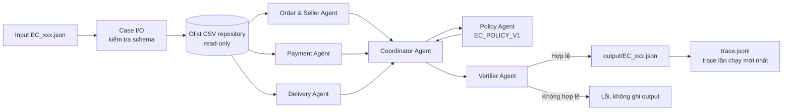

# Kiến trúc hệ thống — Multi-Agent E-commerce Dispute Resolution

## Mục tiêu thiết kế

Hệ thống xử lý từng khiếu nại Olist bằng các agent chuyên trách, mỗi agent chỉ kết luận từ dữ liệu CSV đã kiểm chứng. Coordinator tổng hợp handoff, Policy áp dụng `EC_POLICY_V1`, sau đó Verifier chặn output có schema, evidence hoặc số tiền sai trước khi ghi file.

## Sơ đồ luồng xử lý



## Vai trò và contract handoff

| Thành phần | Input | Handoff/output | Trách nhiệm |
| --- | --- | --- | --- |
| Case I/O | JSON case | `CaseInput` | Kiểm tra filename, `case_id`, `claimed_order_id` và `EC_POLICY_V1`. |
| OlistRepository | `claimed_order_id`, CSV | `OrderFacts` | Đọc order, item, payment từ CSV; dùng `Decimal` cho tiền; không tạo dữ liệu mới. |
| Order & Seller Agent | `OrderFacts` | `OrderSellerHandoff` | Xác thực status, item, seller và evidence ID liên quan. |
| Payment Agent | `OrderFacts` | `PaymentHandoff` | Tính payment/item/freight, kiểm tra sai số đối soát tối đa 0.10 BRL và split payment. |
| Delivery Agent | `OrderFacts` | `DeliveryHandoff` | So sánh delivery date với estimate và carrier handoff với shipping limit. |
| Policy Agent | Facts + ba handoff | `PolicyDecision` | Áp thứ tự ưu tiên của `EC_POLICY_V1`, chọn issue/root cause/refund/action. |
| Coordinator Agent | Case, facts, decision | Output JSON in-memory | Hợp nhất dữ liệu vào schema nộp bài, giới hạn số ID/evidence/action. |
| Verifier Agent | Output JSON, case, facts | Pass/exception | Kiểm tra schema, entity/evidence ID, giới hạn, tổng tiền và status-refund. |
| BatchRunner | 50 input | 50 JSON + trace | Chạy tuần tự toàn bộ batch; ghi đè trace để chỉ giữ lần chạy mới nhất. |

## Quyền truy cập dữ liệu

| Thành phần | Đọc | Ghi | Giới hạn |
| --- | --- | --- | --- |
| Repository và các agent phân tích | `data/` | Không | CSV là nguồn sự thật duy nhất. |
| Case I/O | `input/` | Không | Không sửa yêu cầu gốc. |
| Coordinator/Verifier | Handoff in-memory | Không trực tiếp | Verifier phải pass trước khi runner ghi file. |
| BatchRunner | `input/`, `data/` | `output/`, `trace.jsonl` | Chỉ ghi output theo đúng tên input; trace bị thay mới, không append. |
| Config/metadata | `config/`, `metadata.json` | Không trong runtime | Không đọc API key, không gọi dịch vụ ngoài. |

## Luồng evidence và bảo đảm tính đúng đắn

1. Repository chỉ trả về row có `order_id` trùng với case.
2. Agent chỉ tạo evidence từ các row đã nhận: `order:`, `item:`, `payment:`, `seller:`; Policy bổ sung `policy:<root_cause_code>`.
3. Coordinator loại trùng và giới hạn evidence tối đa 10 ID.
4. Verifier dựng lại tập ID hợp lệ từ `OrderFacts`; bất kỳ ID không tồn tại sẽ làm case lỗi thay vì được ghi ra output.
5. Verifier đối soát `item_total_brl`, `freight_total_brl`, `payment_total_brl` với `Decimal` từ CSV và kiểm tra `case_status` khớp khoản hoàn.

## Cách chạy

```powershell
$env:PYTHONPATH = 'src'
& .\.venv\Scripts\python.exe -m dispute_resolution.cli run --data-dir data --input-dir input --output-dir output --trace-path trace.jsonl
```

Lệnh yêu cầu chính xác 50 file `EC_001.json` đến `EC_050.json`. Sau khi chạy, dùng Verifier để kiểm tra lại toàn bộ output trước khi nén riêng thư mục `output/`.
